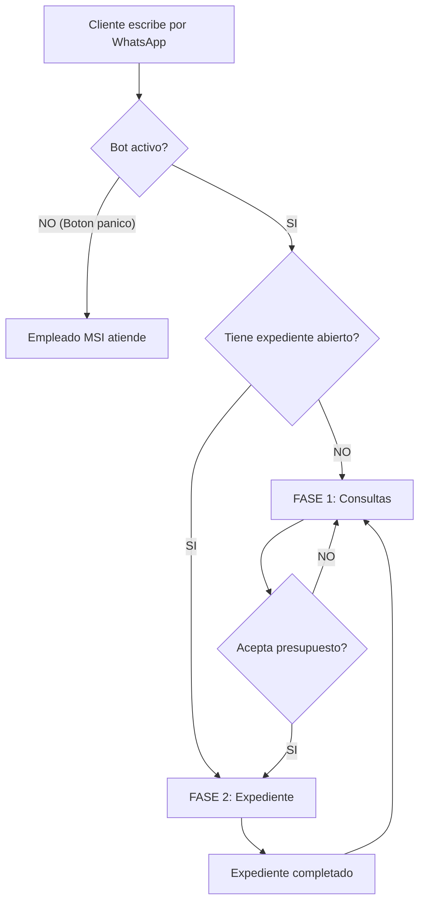
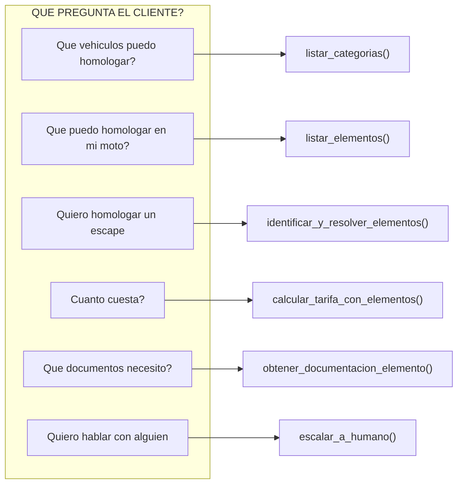
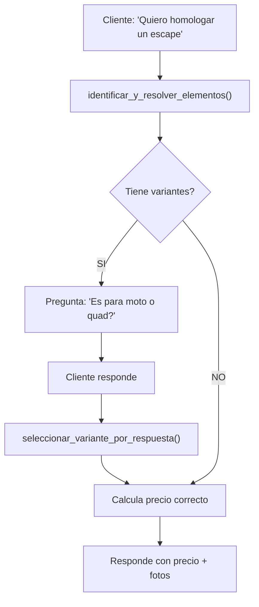
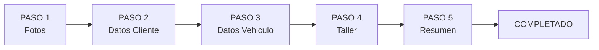
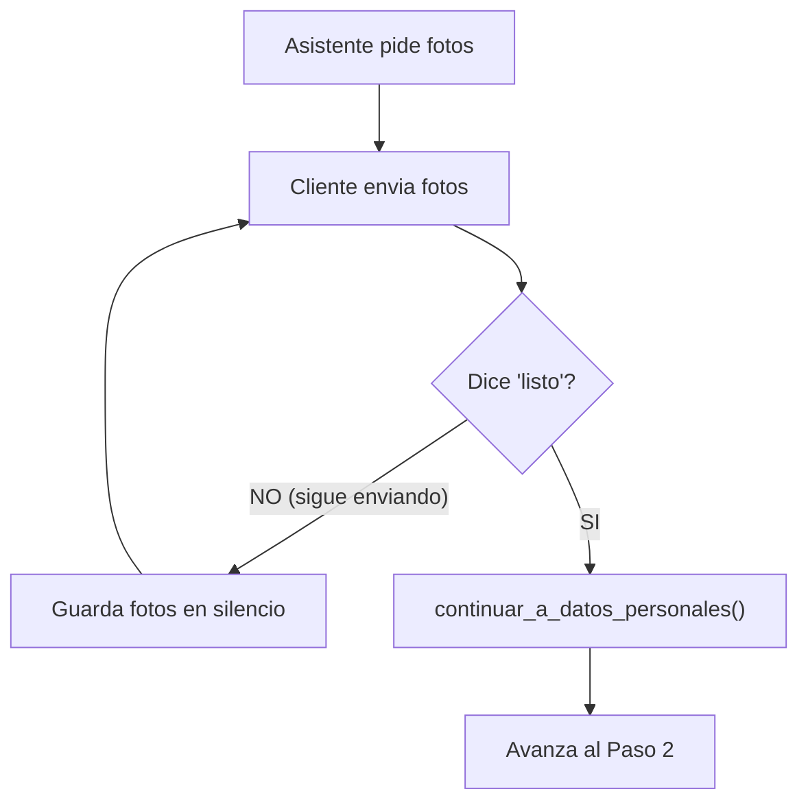
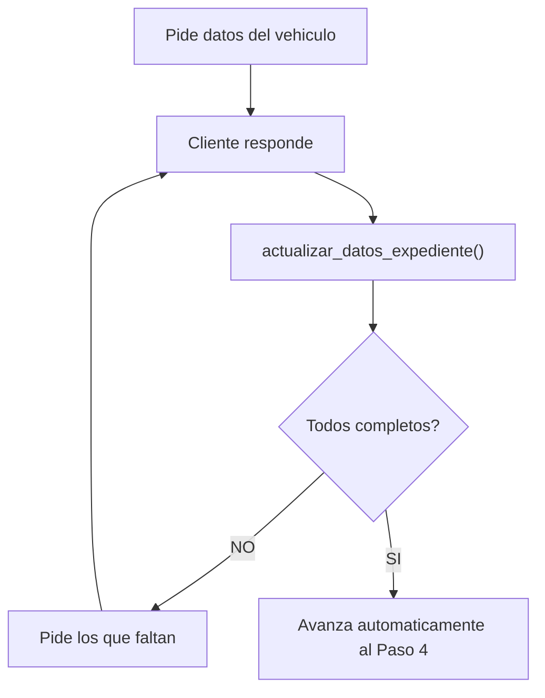
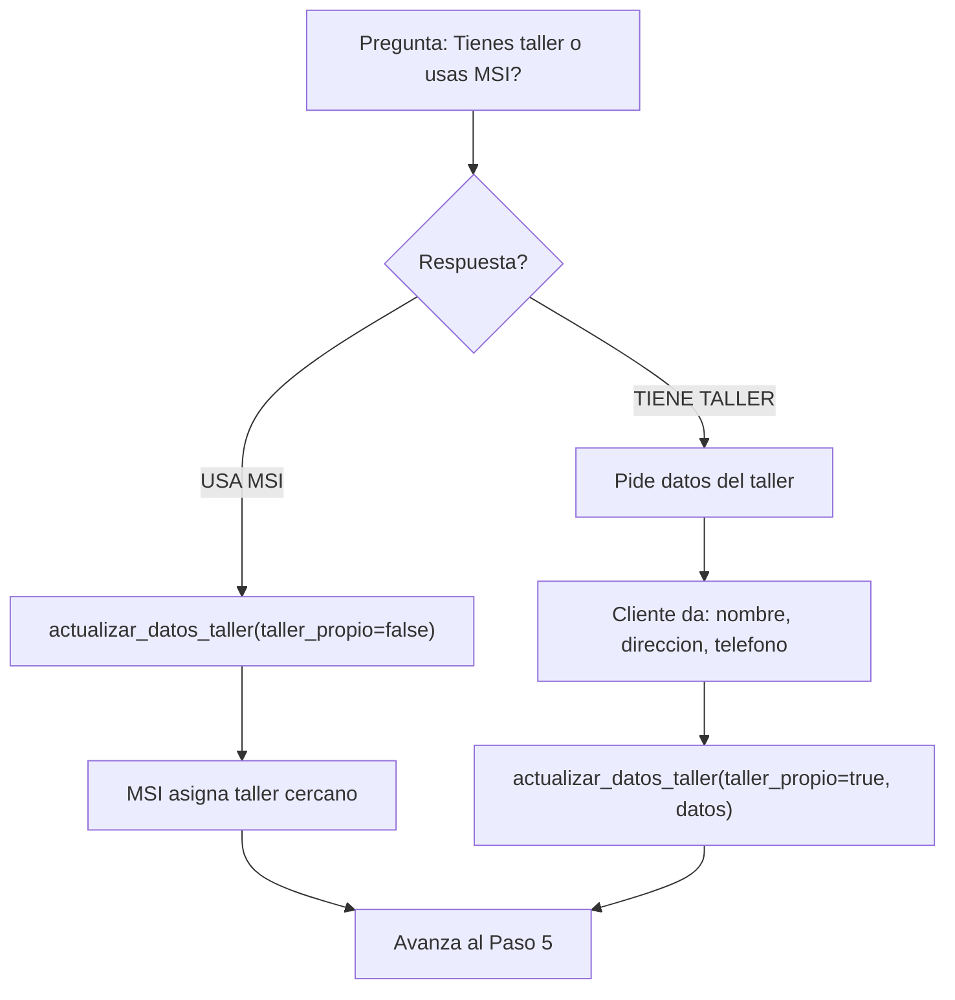
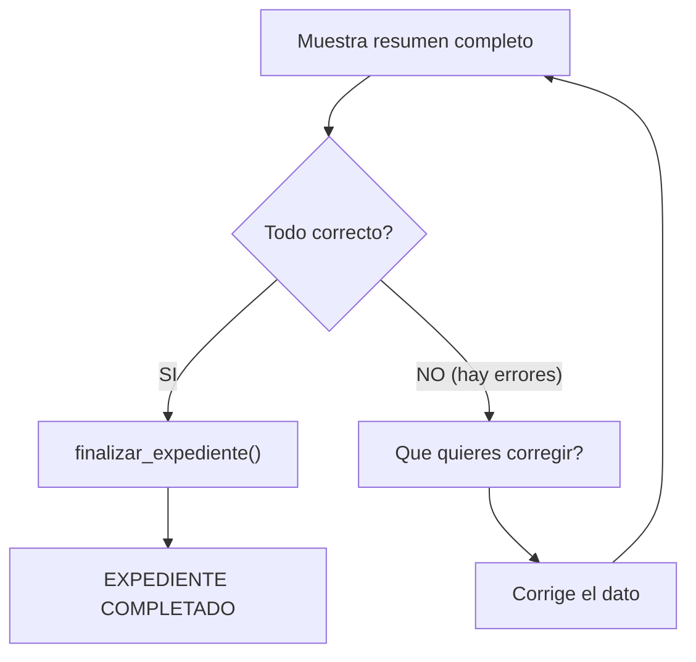
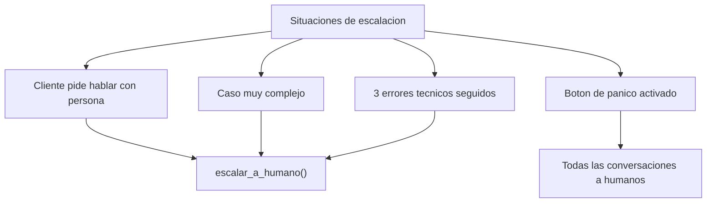

# Arquitectura del Asistente Virtual MSI Automotive

**Documento para:** Equipo MSI Automotive  
**Version:** 1.0  
**Fecha:** Enero 2026

---

## Indice

1. [Vision General](#1-vision-general)
2. [Diagrama de Flujo Principal](#2-diagrama-de-flujo-principal)
3. [Fase 1: Consultas y Presupuestos](#3-fase-1-consultas-y-presupuestos)
4. [Fase 2: Apertura de Expediente](#4-fase-2-apertura-de-expediente)
5. [Arbol de Decisiones](#5-arbol-de-decisiones)
6. [Tabla de Herramientas](#6-tabla-de-herramientas)
7. [Escalacion y Cancelacion](#7-escalacion-y-cancelacion)

---

## 1. Vision General

El asistente virtual de MSI Automotive es como un **empleado de atencion al cliente** que trabaja 24/7 atendiendo consultas por WhatsApp.

### Que puede hacer el asistente

| PUEDE | NO PUEDE |
|-------|----------|
| Responder preguntas sobre homologaciones | Aprobar una homologacion |
| Dar presupuestos exactos | Cobrar dinero |
| Enviar fotos de ejemplo | Inspeccionar un vehiculo |
| Recoger datos para expedientes | Firmar documentos oficiales |
| Pasar la conversacion a un humano | Tomar decisiones complejas |

### Flujo basico

```
Cliente escribe     Asistente procesa     Cliente recibe
por WhatsApp   -->  y responde       -->  respuesta
                    automaticamente
```

---

## 2. Diagrama de Flujo Principal



---

## 3. Fase 1: Consultas y Presupuestos

En esta fase, el cliente puede hacer **cualquier pregunta** sobre homologaciones y pedir presupuestos.

### 3.1 Tipos de consultas y herramientas



### 3.2 Ejemplo completo de consulta con presupuesto

| Paso | Cliente dice | Asistente hace | Herramienta |
|------|--------------|----------------|-------------|
| 1 | "Hola, quiero homologar un escape" | Identifica que es un escape | `identificar_y_resolver_elementos()` |
| 2 | - | Detecta que hay variantes (moto/quad) | - |
| 3 | - | Pregunta: "Es para moto o quad?" | - |
| 4 | "Para mi moto Honda" | Selecciona variante "moto" | `seleccionar_variante_por_respuesta()` |
| 5 | - | Calcula el precio | `calcular_tarifa_con_elementos()` |
| 6 | - | Responde: "El precio es 180 EUR..." | - |
| 7 | - | Envia fotos de ejemplo | `enviar_imagenes_ejemplo()` |

### 3.3 Decision: Tiene variantes?

Algunos elementos tienen **variantes** que afectan el precio. El asistente pregunta para desambiguar:



**Ejemplo SI tiene variantes:**
> **Cliente:** "Quiero homologar un escape"  
> **Asistente:** "Entendido! Es para moto o para quad? El precio varia segun el tipo de vehiculo."  
> **Cliente:** "Para moto"  
> **Asistente:** "El escape para moto cuesta 180 EUR, incluye certificado e informe de la ITV..."

**Ejemplo NO tiene variantes:**
> **Cliente:** "Quiero homologar unas luces LED"  
> **Asistente:** "Las luces LED cuestan 120 EUR, incluye certificado e informe de la ITV..."

---

## 4. Fase 2: Apertura de Expediente

Cuando el cliente **acepta el presupuesto**, el asistente guia al cliente paso a paso para recoger toda la informacion necesaria.

### 4.1 Los 5 pasos del expediente



---

### PASO 1: Recopilacion de Fotos

**Objetivo:** Recoger fotos del vehiculo y elementos a homologar.



| Si el cliente... | El asistente... |
|------------------|-----------------|
| Envia fotos | Las guarda en silencio (no responde a cada una) |
| Dice "listo" | Cuenta las fotos y avanza al siguiente paso |
| Hace una pregunta | Responde sin perder el progreso del expediente |
| Quiere cancelar | Cancela el expediente y vuelve a consultas |

**Ejemplo:**
> **Asistente:** "He creado tu expediente. Ahora necesito que me envies fotos de: la placa del fabricante, el escape instalado, y el vehiculo completo. Cuando termines, escribe 'listo'."  
> **Cliente:** *(envia 5 fotos)*  
> **Cliente:** "Listo, ya estan todas"  
> **Asistente:** "Perfecto! He recibido 5 fotos. Ahora necesito tus datos personales..."

**Herramientas disponibles:**
- `continuar_a_datos_personales()` - Avanza al paso 2
- `obtener_estado_expediente()` - Ver cuantas fotos se han recibido
- `consulta_durante_expediente()` - Responder preguntas sin perder progreso
- `cancelar_expediente()` - Cancelar todo

---

### PASO 2: Datos del Cliente

**Objetivo:** Recoger datos personales del cliente.

**Campos requeridos:**

| Campo | Ejemplo |
|-------|---------|
| Nombre | Juan |
| Apellidos | Garcia Lopez |
| DNI/CIF | 12345678A |
| Email | juan@email.com |
| Calle | C/ Mayor |
| Numero | 15 |
| Codigo Postal | 28001 |
| Ciudad | Madrid |
| Provincia | Madrid |
| ITV cercana | ITV Madrid Norte |


**Ejemplo incompleto:**
> **Asistente:** "Necesito tus datos personales. Me dices tu nombre completo y DNI?"  
> **Cliente:** "Juan Garcia, DNI 12345678A"  
> **Asistente:** "Perfecto Juan. Me falta tu email y direccion completa (calle, numero, codigo postal, ciudad y provincia)."

**Ejemplo completo:**
> **Cliente:** "juan@email.com, vivo en C/ Mayor 15, 28001 Madrid"  
> **Asistente:** "Genial! Solo me falta saber cual es tu ITV mas cercana."  
> **Cliente:** "ITV Madrid Norte"  
> **Asistente:** "Perfecto, datos guardados! Ahora necesito los datos del vehiculo..."

---

### PASO 3: Datos del Vehiculo

**Objetivo:** Recoger datos del vehiculo a homologar.

**Campos requeridos:**

| Campo | Ejemplo |
|-------|---------|
| Marca | Honda |
| Modelo | CBF600 |
| Anio | 2019 |
| Matricula | 1234ABC |
| Bastidor (VIN) | JHMCB7650KC123456 |



**Ejemplo:**
> **Asistente:** "Ahora los datos del vehiculo. Marca, modelo y anio?"  
> **Cliente:** "Honda CBF600 del 2019"  
> **Asistente:** "Perfecto. Me dices la matricula y el numero de bastidor?"  
> **Cliente:** "1234ABC, bastidor JHMCB7650KC123456"  
> **Asistente:** "Genial, datos del vehiculo completados! Ahora una ultima cosa..."

---

### PASO 4: Taller

**Objetivo:** Saber si el cliente tiene taller propio o usara uno de MSI.



**Ejemplo usa MSI:**
> **Asistente:** "Tienes un taller de confianza donde llevar la moto para la inspeccion, o prefieres que MSI te asigne uno?"  
> **Cliente:** "No tengo, usare el vuestro"  
> **Asistente:** "Perfecto, te asignaremos el taller mas cercano a tu domicilio."

**Ejemplo tiene taller:**
> **Cliente:** "Tengo mi mecanico de siempre"  
> **Asistente:** "Genial! Necesito el nombre del taller, direccion y telefono de contacto."  
> **Cliente:** "Motos Garcia, C/ Taller 5, Madrid, telefono 912345678"  
> **Asistente:** "Perfecto, anotado!"

---

### PASO 5: Resumen y Confirmacion

**Objetivo:** Mostrar todos los datos para que el cliente confirme.



**Ejemplo resumen:**
> **Asistente:** "Este es el resumen de tu expediente:
> 
> **Cliente:** Juan Garcia Lopez (12345678A)  
> **Email:** juan@email.com  
> **Direccion:** C/ Mayor 15, 28001 Madrid  
> 
> **Vehiculo:** Honda CBF600 (2019)  
> **Matricula:** 1234ABC  
> **Bastidor:** JHMCB7650KC123456  
> 
> **Taller:** Motos Garcia (C/ Taller 5, Madrid)  
> 
> **Servicio:** Homologacion escape - 180 EUR  
> 
> Es todo correcto?"

**Ejemplo confirma:**
> **Cliente:** "Si, todo bien"  
> **Asistente:** "Expediente completado! Te contactaremos pronto para coordinar la cita en el taller."

**Ejemplo corrige:**
> **Cliente:** "El email esta mal, es juang@gmail.com"  
> **Asistente:** "Corregido! *(muestra nuevo resumen)* Ahora si esta todo bien?"

---

## 5. Arbol de Decisiones

Este es el resumen de TODAS las decisiones que toma el asistente:

### Decision 1: Esta activo el bot?

| Condicion | Accion | Ejemplo |
|-----------|--------|---------|
| **SI** | Procesa el mensaje normalmente | Cliente escribe, asistente responde |
| **NO** (boton panico) | Responde automatico y pasa a humano | "Un agente te atendera en breve" |

### Decision 2: Que quiere el cliente?

| Condicion | Accion | Herramienta |
|-----------|--------|-------------|
| Info general | Muestra categorias/elementos | `listar_categorias()` o `listar_elementos()` |
| Presupuesto | Identifica y calcula precio | `identificar_y_resolver_elementos()` + `calcular_tarifa_con_elementos()` |
| Abrir expediente | Inicia proceso de 5 pasos | `iniciar_expediente()` |
| Hablar con humano | Escala la conversacion | `escalar_a_humano()` |

### Decision 3: Tiene variantes el elemento?

| Condicion | Accion | Ejemplo |
|-----------|--------|---------|
| **SI** | Pregunta para desambiguar | "Es para moto o quad?" |
| **NO** | Calcula precio directamente | Luces LED = 120 EUR |

### Decision 4: Acepta el presupuesto?

| Condicion | Accion |
|-----------|--------|
| **SI** | Crea expediente y pasa a Fase 2 |
| **NO** | Sigue en modo consultas |
| **Tiene dudas** | Responde dudas y vuelve a ofrecer |

### Decision 5: Fotos completadas?

| Condicion | Accion |
|-----------|--------|
| Dice "listo" | Avanza a datos personales |
| Sigue enviando | Guarda en silencio |
| Hace pregunta | Responde sin perder progreso |

### Decision 6: Datos completos?

| Condicion | Accion |
|-----------|--------|
| **SI** | Avanza al siguiente paso automaticamente |
| **NO** | Pide los campos que faltan |

### Decision 7: Tiene taller propio?

| Condicion | Accion |
|-----------|--------|
| Usa MSI | MSI asigna taller cercano |
| Tiene taller | Pide datos del taller |

### Decision 8: Resumen correcto?

| Condicion | Accion |
|-----------|--------|
| **SI** | Finaliza expediente |
| **NO** | Permite corregir y muestra nuevo resumen |

---

## 6. Tabla de Herramientas

### Herramientas de Consulta (Fase 1)

| Herramienta | Para que sirve | Cuando se usa |
|-------------|----------------|---------------|
| `listar_categorias()` | Ver tipos de vehiculos | "Que vehiculos puedo homologar?" |
| `listar_elementos(categoria)` | Ver elementos homologables | "Que puedo homologar en mi moto?" |
| `identificar_y_resolver_elementos()` | Entender lo que quiere el cliente | "Quiero homologar un escape" |
| `seleccionar_variante_por_respuesta()` | Elegir variante correcta | Despues de preguntar "moto o quad?" |
| `calcular_tarifa_con_elementos()` | Calcular precio exacto | "Cuanto cuesta?" |
| `enviar_imagenes_ejemplo()` | Mostrar fotos de ejemplo | Despues de dar el precio |
| `obtener_documentacion_elemento()` | Listar documentos necesarios | "Que papeles necesito?" |
| `listar_tarifas()` | Tabla de precios general | "Cuales son vuestros precios?" |
| `obtener_servicios_adicionales()` | Ver extras (urgente, etc.) | "Teneis servicio express?" |
| `identificar_tipo_vehiculo()` | Detectar tipo de vehiculo | "Tengo una Honda CBF600" |

### Herramientas de Expediente (Fase 2)

| Herramienta | Para que sirve | Cuando se usa |
|-------------|----------------|---------------|
| `iniciar_expediente()` | Crear expediente nuevo | Cliente acepta presupuesto |
| `continuar_a_datos_personales()` | Avanzar de fotos a datos | Cliente dice "listo" |
| `actualizar_datos_expediente()` | Guardar datos cliente/vehiculo | Durante pasos 2 y 3 |
| `actualizar_datos_taller()` | Guardar decision de taller | Durante paso 4 |
| `finalizar_expediente()` | Completar expediente | Cliente confirma resumen |
| `obtener_estado_expediente()` | Ver que falta | Consultar progreso |
| `consulta_durante_expediente()` | Responder preguntas | Sin perder el progreso |

### Herramientas Globales (cualquier momento)

| Herramienta | Para que sirve | Cuando se usa |
|-------------|----------------|---------------|
| `escalar_a_humano()` | Pasar a empleado MSI | Cliente lo pide o caso complejo |
| `cancelar_expediente()` | Cancelar expediente activo | Cliente quiere cancelar |

---

## 7. Escalacion y Cancelacion

### Cuando se escala a un humano?



| Situacion | Que pasa |
|-----------|----------|
| Cliente pide humano | "Quiero hablar con alguien" -> Escala |
| Caso complejo | Asistente detecta que no puede ayudar -> Escala |
| Errores tecnicos | Despues de 3 errores -> Escala automatico |
| Boton de panico | Admin lo activa -> TODAS las conversaciones van a humanos |

### Cuando se cancela un expediente?

| Situacion | Que pasa |
|-----------|----------|
| Cliente dice "cancela" | Se cancela y vuelve a consultas |
| Cliente abandona | El expediente queda pendiente |
| Cliente quiere empezar de nuevo | Puede cancelar y abrir otro |

---

## Resumen Visual Final

```
CLIENTE CONTACTA
       |
       v
  [Bot activo?]
       |
   SI-----------NO (panico)
   |                  |
   v                  v
[Tiene expediente?]  [Humano atiende]
   |
SI-----------NO
|            |
v            v
FASE 2     FASE 1
Expediente Consultas
   |            |
   |     [Acepta presupuesto?]
   |            |
   |       SI---NO
   |       |    |
   |<------+    |
   |            v
   |      [Sigue consultando]
   |
   v
PASO 1: Fotos -----> [Listo?] --NO--> Guarda silencio
                        |
                       SI
                        v
PASO 2: Cliente ----> [Completo?] --NO--> Pide lo que falta
                        |
                       SI
                        v
PASO 3: Vehiculo ---> [Completo?] --NO--> Pide lo que falta
                        |
                       SI
                        v
PASO 4: Taller -----> [MSI o propio?]
                        |
                        v
PASO 5: Resumen ----> [Correcto?] --NO--> Corrige
                        |
                       SI
                        v
                 EXPEDIENTE COMPLETADO
                        |
                        v
                 Vuelve a FASE 1
```

---

*Documento generado para MSI Automotive - Enero 2026*
