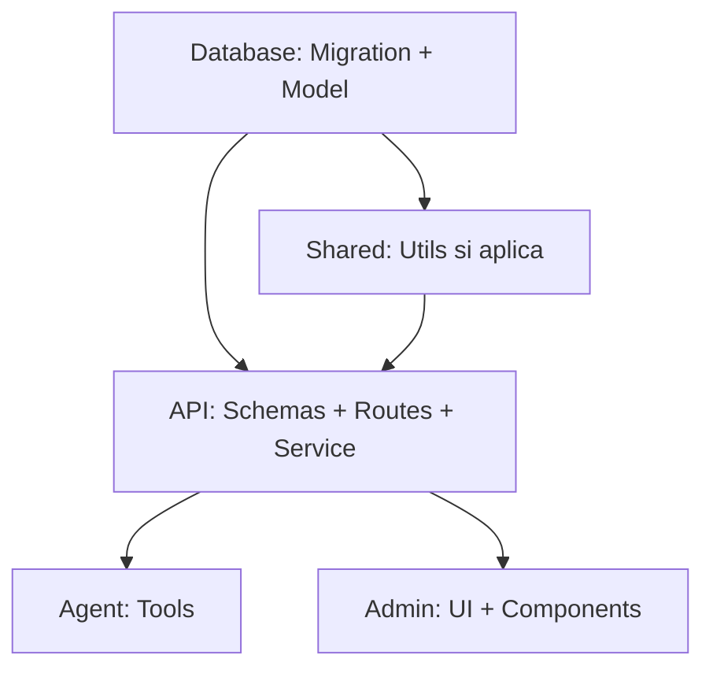

# Plan: [Nombre Descriptivo]

> **Status**: 🟡 Proposed | 🟢 Approved | 🔵 In Progress | ✅ Completed | ❌ Cancelled  
> **Created**: YYYY-MM-DD  
> **Updated**: YYYY-MM-DD  
> **Priority**: 🔴 High | 🟡 Medium | 🟢 Low

---

## Resumen Ejecutivo

Breve descripción (2-3 frases) de qué se va a construir/arreglar y por qué es importante.

---

## Problema

### Contexto

¿Qué situación actual motiva este plan?

### Pain Points

- Pain point 1
- Pain point 2
- ...

### Requisitos de Negocio

- Requisito funcional 1
- Requisito funcional 2
- ...

---

## Solución Propuesta

### Enfoque General

Descripción high-level de cómo se va a resolver el problema.

### Alternativas Consideradas

| Opción | Pros | Contras | Decisión |
|--------|------|---------|----------|
| Opción A | ... | ... | ✅ Seleccionada / ❌ Descartada |
| Opción B | ... | ... | ❌ Descartada |

### Decisiones Arquitectónicas

- **Decisión 1**: Razón
- **Decisión 2**: Razón

---

## Servicios Afectados

- [ ] **Agent** (`agent/`) — Tools, modes, prompts, state
- [ ] **API** (`api/`) — Routes, services, Pydantic schemas
- [ ] **Admin Panel** (`admin-panel/`) — Pages, components, types
- [ ] **Database** (`database/`) — Models, migrations, seeds
- [ ] **Shared** (`shared/`) — Utilities, LLM router, Redis client

---

## Tareas por Servicio

### Database → **database-dev**

**Responsable**: database-dev  
**Prioridad**: 1 (primero — otros dependen de esto)

- [ ] Crear migration `XXX_nombre_descriptivo.py`
- [ ] Agregar modelo `NuevoModelo` en `models.py`
- [ ] Actualizar seeders si aplica
- [ ] **Tests**: migration up/down, model relationships

**Interfaz Expuesta**:
```python
# Modelo/tabla disponible para otros servicios
class NuevoModelo(Base):
    __tablename__ = "nuevo_modelo"
    id = Column(UUID, ...)
```

---

### API → **backend-dev**

**Responsable**: backend-dev  
**Prioridad**: 2 (depende de Database)

- [ ] Crear Pydantic schemas en `api/models/nuevo.py`
- [ ] Implementar service en `api/services/nuevo_service.py`
- [ ] Crear router en `api/routes/nuevo.py`
- [ ] Agregar router a `main.py`
- [ ] **Tests**: routes (auth, responses), service logic

**Interfaz Expuesta**:
```
POST   /api/nuevo           Create
GET    /api/nuevo           List (paginated)
GET    /api/nuevo/{id}      Read
PATCH  /api/nuevo/{id}      Update
DELETE /api/nuevo/{id}      Delete (soft)
```

**Schemas**:
```python
class NuevoCreate(BaseModel): ...
class NuevoResponse(BaseModel): ...
class NuevoUpdate(BaseModel): ...
```

---

### Agent → **agent-dev**

**Responsable**: agent-dev  
**Prioridad**: 2 (depende de API)

- [ ] Crear tool `hacer_algo()` en `agent/tools/nuevo_tools.py`
- [ ] Actualizar prompt mode en `agent/prompts/modes/presupuesto_mode.md` (si aplica)
- [ ] Agregar tool a mode filter en `agent/modes/presupuesto_mode.py`
- [ ] **Tests**: tool execution, mode integration

**Interfaz Expuesta**:
```python
@tool
async def hacer_algo(parametro: str) -> dict:
    """Tool description for LLM."""
    ...
```

---

### Admin Panel → **frontend-dev**

**Responsable**: frontend-dev  
**Prioridad**: 3 (depende de API)

- [ ] Crear types en `lib/types.ts` (mirror de Pydantic schemas)
- [ ] Agregar API client methods en `lib/api.ts`
- [ ] Crear page en `app/(dashboard)/nuevo/page.tsx`
- [ ] Crear componentes necesarios en `components/nuevo/`
- [ ] **Tests**: component rendering, API integration

**Interfaz Expuesta**:
```typescript
interface Nuevo {
  id: string
  campo: string
  // ... mirror de NuevoResponse
}

// API client
getNuevos(): Promise<PaginatedResponse<Nuevo>>
createNuevo(data: NuevoCreate): Promise<Nuevo>
```

---

### Shared → **backend-dev** (si aplica)

**Responsable**: backend-dev  
**Prioridad**: 1 (si otros dependen)

- [ ] Agregar utility en `shared/nuevo_util.py`
- [ ] Actualizar `shared/config.py` con nuevas env vars
- [ ] **Tests**: utility functions

---

## Dependencias entre Tareas



**Orden de Ejecución**:
1. Database (migrations, models)
2. API (schemas, routes, services) + Shared (si aplica)
3. Agent (tools, prompts) + Admin (UI) en paralelo
4. Tests integration
5. QA verification

---

## Tests Requeridos

### Unit Tests

- [ ] Database: migration up/down, model relationships
- [ ] API: service logic, route handlers
- [ ] Agent: tool execution, mode transitions
- [ ] Frontend: component rendering

### Integration Tests

- [ ] Database → API: query/mutation operations
- [ ] API → Agent: tool calling endpoints
- [ ] API → Admin: CRUD operations

### Criterios de Aceptación

- [ ] Coverage >90% for new code
- [ ] All existing tests pass
- [ ] New functionality tested end-to-end

---

## Criterios de Aceptación

### Funcional

- [ ] Criterio 1: Como usuario puedo [acción] y veo [resultado]
- [ ] Criterio 2: ...
- [ ] Criterio 3: ...

### No Funcional

- [ ] Performance: [métrica específica]
- [ ] Security: [requisitos de seguridad]
- [ ] Usability: [requisitos UX]

---

## Checklist de Verificación Pre-Deploy

### Database

- [ ] Migration testeada en ambiente local
- [ ] Downgrade funciona correctamente
- [ ] Seeders actualizados si aplica
- [ ] No hay foreign keys sin `ondelete` policy

### API

- [ ] Endpoints documentados en Swagger/OpenAPI
- [ ] Auth guards aplicados correctamente
- [ ] Pydantic validation completa
- [ ] Error handling apropiado (HTTPException con mensajes en español)

### Agent

- [ ] Tools testeados con mock data
- [ ] Prompts actualizados en `prompts/modes/`
- [ ] Tool logging habilitado
- [ ] Mode transitions funcionan

### Admin

- [ ] Types sincronizados con backend
- [ ] API client methods testeados
- [ ] UI responsive (mobile/desktop)
- [ ] Feedback de usuario (toast notifications)

### General

- [ ] ADR creado si hay decisión arquitectónica (ver `docs/decisions/template.md`)
- [ ] Coding standards seguidos (`docs/coding-standards/`)
- [ ] Skills actualizadas si aplica (`/sync-docs`)
- [ ] README actualizado si cambia arquitectura

---

## Rollback Plan

### Si falla en desarrollo

- Revertir migration: `alembic downgrade -1`
- Eliminar código agregado
- Restaurar desde backup si aplica

### Si falla en producción

1. **Inmediato**: Stop affected services
2. **Database**: Run downgrade migration
3. **Code**: Revert to previous commit
4. **Restart**: Services con código anterior
5. **Verify**: Health checks pass

---

## Monitoreo Post-Deploy

### Métricas a Observar

- [ ] Error rates en logs (contenedor específico)
- [ ] Response times de nuevos endpoints
- [ ] Database query performance
- [ ] LLM token usage si aplica

### Alertas a Configurar

- [ ] Error rate > 5% en nuevos endpoints
- [ ] Response time > 2s
- [ ] ...

---

## Notas Adicionales

### Referencias

- ADR relacionados: `docs/decisions/XXX-nombre.md`
- Issues relacionados: #123, #456
- PRs relacionados: #789

### Riesgos Identificados

| Riesgo | Impacto | Probabilidad | Mitigación |
|--------|---------|--------------|------------|
| Ejemplo: Migration falla en prod | Alto | Baja | Testear en staging primero |

### Aprendizajes

(Completar después de implementar)

- Lección 1
- Lección 2

---

**Plan creado por**: [Nombre]  
**Revisado por**: [Nombre]  
**Aprobado por**: [Nombre]  
**Completado**: YYYY-MM-DD (si aplica)
